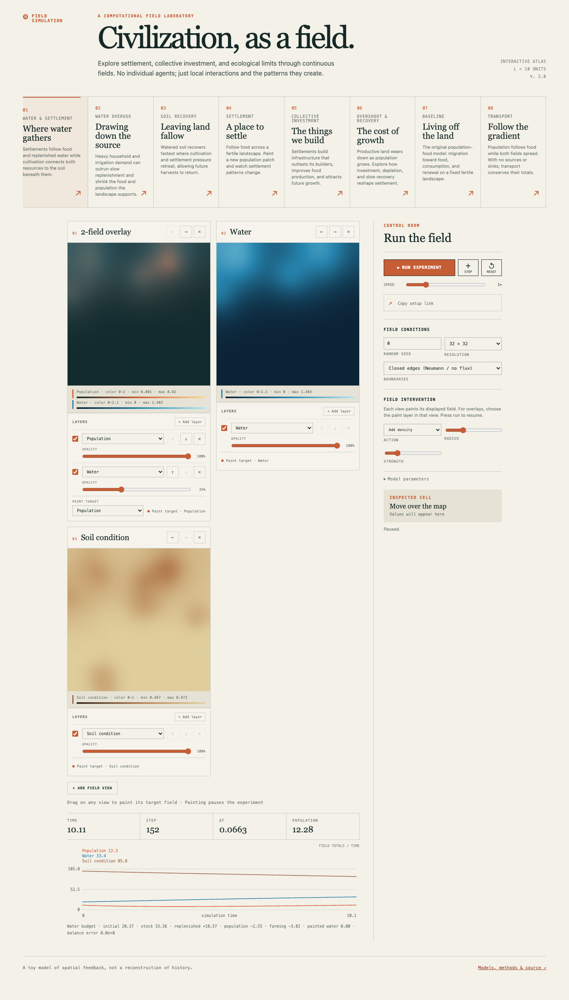

# Civilization Fields

A field laboratory for exploring how settlements emerge, build, and exhaust the landscapes that sustain them. Population, food, infrastructure, water, and soil are continuous spatial fields: there are no individual agents.

The project combines a generic **JAX reaction–advection–diffusion simulator** with a lightweight **browser sandbox**. A Web Worker runs the browser solver locally; no backend or account is needed.

**[Open the laboratory](https://twallengren.github.io/field-sim/)**



## Explore

| Experiment | What to try |
| --- | --- |
| **A place to settle** | Add a population patch and watch people follow food. |
| **The things we build** | Invest in infrastructure, then reduce construction and watch what persists. |
| **The cost of growth** | Follow expansion through soil depletion; change recovery or restore land. |
| **Living off the land** | Inspect the original population–food agriculture model. |
| **Follow the gradient** | Watch pure transport conserve population and food. |
| **Where water gathers** | Follow food and replenished water through cultivation and soil feedback. |
| **Drawing down the source** | Compare household and irrigation withdrawals with finite source recharge. |
| **Leaving land fallow** | Start with depleted soil and watch watered, low-pressure land recover. |

Choose closed edges (zero-flux Neumann) or wraparound (periodic), adjust parameters, compose any number of map tiles, compare fields, and paint interventions. Each tile can contain ordered layers with independent visibility and opacity and has its own paint target. Derived cultivation is read-only. Setup links reproduce initial conditions, model parameters, and tile layout; they do **not** save painted changes or an evolved world.

These are qualitative, dimensionless toy models of spatial feedback, not calibrated historical or ecological explanations. Read the [sandbox guide](docs/sandbox.md) and [model equations](docs/models.md).

## Run the browser app

Use Node.js **22.12+** or **24+** and npm:

```sh
cd web
npm ci
npm run dev
```

Open **http://127.0.0.1:5173/field-sim/**. The app starts paused. No Python installation is needed for browser use.

```sh
npm test
npm run build
npm run preview
```

The production build is `web/dist`. See [GitHub Pages deployment](docs/development.md#github-pages) for publishing under `/field-sim/`.

## Run the Python reference

Python **3.10+**, with a compatible CPU JAX build:

```sh
python3 -m venv .venv
.venv/bin/pip install -e '.[dev]'
.venv/bin/fieldsim-run --sim civilization --preset overshoot --resolution 32 --years 30 --no-anim
.venv/bin/fieldsim-run --sim civilization --preset collective_investment --boundary periodic --param investment=0.2 --years 10 --no-anim
.venv/bin/fieldsim-run --sim ecology --preset water_overuse --resolution 32 --years 30 --no-anim
.venv/bin/fieldsim-run --sim chemotaxis_demo --save transport.gif
.venv/bin/pytest -q
```

`--years` is the legacy duration flag; civilization and ecology experiments use dimensionless time. Agriculture and chemotaxis retain their original units and default fixed timestep. Civilization and ecology default to adaptive **explicit Euler**, never an implicit solver. Ecology presets are `water_settlement`, `water_overuse`, and `soil_recovery`.

```python
from fieldsim.simulations.civilization import get_config
from fieldsim.simulation_runner import SimulationRunner

config = get_config(preset="overshoot", seed=7, n=32,
                    bc_type="periodic", total_time=30)
runner = SimulationRunner(config, max_frames=100)
runner.run()
print(runner.history_times[-1], runner.simulator.get_state()["population"])
```

## Architecture

- `src/fieldsim`: composable Python fields, variational diffusion, conservative transport, sources, and simulations.
- `src/fieldsim/catalog.json`: shared gallery ordering, parameters, browser controls, and ranges.
- `web`: Canvas visualization and a TypeScript worker solver for registered models, with no runtime framework dependencies.
- `scripts/generate_reference.py`: JAX float64 trajectories used to test the browser implementation.

New civilization and ecology seeds agree across runtimes within floating-point tolerance. Legacy Python demos retain their NumPy initializer; equal seed numbers alone do not reproduce browser baseline maps. Their parity tests supply identical arrays.

Read [the model equations](docs/models.md), [the sandbox guide](docs/sandbox.md), [numerics and guarantees](docs/numerics.md), or [development and extension](docs/development.md) for details.
